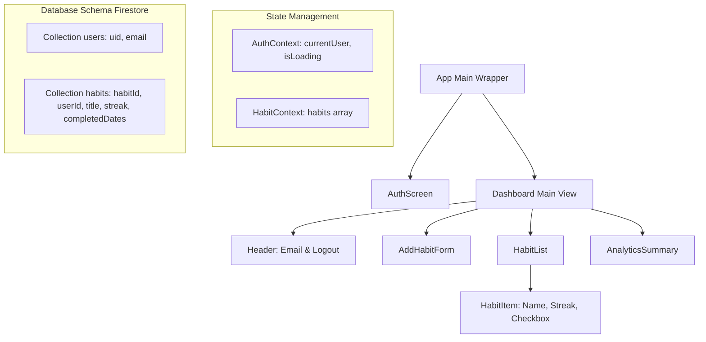

# Architecture Diagrams

## Mermaid JS Code
(You can use this code to generate diagrams)

```mermaid
graph TD
    %% Component Tree
    App[App Main Wrapper] --> AuthScreen[AuthScreen]
    App --> Dashboard[Dashboard Main View]
    
    Dashboard --> Header[Header: Email & Logout]
    Dashboard --> AddHabitForm[AddHabitForm]
    Dashboard --> HabitList[HabitList]
    HabitList --> HabitItem[HabitItem: Name, Streak, Checkbox]
    Dashboard --> AnalyticsSummary[AnalyticsSummary]

    %% State Management
    subgraph State Management
        AuthContext[AuthContext: currentUser, isLoading]
        HabitContext[HabitContext: habits array]
    end

    %% Database Schema
    subgraph Database Schema Firestore
        Users[Collection users: uid, email]
        Habits[Collection habits: habitId, userId, title, streak, completedDates]
    end
```
